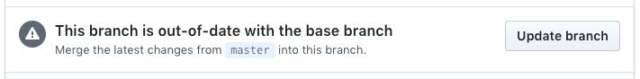

## Submitting issues

If you have questions about how to use ownCloud, please join our [rocket chat channel][rocketchat] or our [forum][forum].

### Guidelines
* [Report the issue](https://github.com/owncloud/android/issues/new) using on of our [templates][template], they include all the information we need to track down the issue.
* This repository is *only* for issues within the ownCloud Android app code. Issues in other components should be reported in their own repositories: 
  - [ownCloud core](https://github.com/owncloud/core/issues)
  - [oCIS](https://github.com/owncloud/ocis/issues)
  - [iOS client](https://github.com/owncloud/ios-app/issues)
  - [Desktop client](https://github.com/owncloud/client/issues)
* Search the [existing issues](https://github.com/owncloud/android/issues) first, it's likely that your issue was already reported.

If your issue appears to be a bug, and hasn't been reported, open a new issue.

Help us to maximize the effort we can spend fixing issues and adding new features, by not reporting duplicate issues.

[template]: https://github.com/owncloud/android/tree/master/.github/ISSUE_TEMPLATE
[rocketchat]: https://talk.owncloud.com/channel/mobile
[forum]: https://central.owncloud.org/

## Contributing to Source Code

Thanks for wanting to contribute source code to ownCloud. That's great!

Before we're able to merge your code into the ownCloud app for Android, please, check the [contribution guidelines][contribution].

### Guidelines
* Contribute your code in a feature, fix or cleanup branch by using  ```feature/feature_name```, ```fix/fix_name``` or ```cleanup/cleanup_name``` branch names. Be sure your feature, fix or cleanup branches are updated with latest changes in official android/master, it will give us a better chance to test your code before merging it with stable code.
* Once you are done with your code, start a pull request to merge your contribution into official android/master.
* Keep on using pull requests for your next contributions although you own write permissions.

[contribution]: https://owncloud.com/contribute/

### 1. Fork and download android/master repository:

* Please follow [SETUP.md](https://github.com/owncloud/android/blob/master/SETUP.md) to setup ownCloud Android app work environment.

### 2. Create pull request:

NOTE: You must sign the [CLA](https://cla-assistant.io/owncloud/android) before your changes can be accepted!

* Create new feature, fix or cleanup branch from your master branch: ```git checkout -b feature/feature_name```
* Register your changes: git add filename
* Commit your changes locally: ```git commit -m "Brief description of the changes performed"```
* Push your changes to your GitHub repo: ```git push origin feature/feature_name```
* Browse to https://github.com/YOURGITHUBNAME/android/pulls and issue pull request
* Enter description and send pull request.

### 3. Update your contribution branch with master changes:

It is possible you see the next message from time to time.



To fix this and make sure your contribution branch is updated with official android/master, you need to perform the next steps:
* Checkout your master branch: ```git checkout master```
* Get and apply official android/master branch changes in your master branch: ```git fetch upstream``` + ```git rebase upstream/master```. Now you have your master branch updated with official master branch changes.
* Checkout your contribution branch: ```git checkout feature/feature_name```
* Rebase contribution branch with master to put your contribution commits after the last commit of master branch, ensuring a clean commits history: ```git rebase master```. If there's some conflicts, solve it by using rebase in different steps.
* Push branch to server: ```git push -f origin feature/feature_name```. At this point, the message ```This branch is out-of-date with the base branch``` should disappear.


## Translations
Please submit translations via [Transifex][transifex].

[transifex]: https://www.transifex.com/projects/p/owncloud/

## Code of conduct
Please, read the [ownCloud code of conduct]. Being respectful and polite with other members of the community and staff is necessary to develop a better product together.

[ownCloud code of conduct]: https://owncloud.com/contribute/code-of-conduct/
