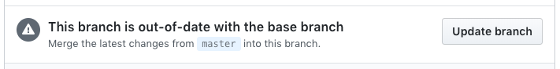

# Contributing

Thank you for your interest in contributing to this project!

Please read the full contributing guidelines at:
**<https://owncloud.com/contribute/>**

For development setup, coding standards, and pull request process,
see the [README](https://github.com/owncloud/android/blob/master/README.md) in this repository.

## Contributing to Source Code

### Guidelines

* Contribute your code in a feature, fix, improvement or technical enhancement  branch by using  one of the following branch names:

     - ```feature/feature_name``` → new features in the app
     - ```fix/fix_name``` → fixing problems or bugs, always welcome!
     - ```improvement/improvement_name``` → make even better an existing feature
     - ```technical/technical_description```  → code review, DB... technical stuff improved

	Please, use the mentioned prefixes because CI system is ready to match with them. Be sure your feature, fix, improvement or technical branches are updated with latest changes in official `android/master`, it will give us a better chance to test your code before merging it with stable code.
* Once you are done with your code, start a pull request to merge your contribution into official `android/master`.
* Keep on using pull requests for your next contributions although you own write permissions.
* Important to mention that ownCloud Android team uses OneFlow as branching model. It's something as useful as easy:

  * `master` will stay as main branch. Everything will work around it.
  * Feature branch: new branch created from `master`. Once it is finished and DoD accomplished, rebased and merged into `master`.
  * Release branch: will work as any feature branch. Before rebasing and merging into `master`, release tag must be signed.
  * Hotfix branch: created from latest tag. Once it is finished, tag must be signed. Then, rebased and merged into `master`.
  * The way to get an specific version is browsing through the tags.

	Interesting [link](https://www.endoflineblog.com/oneflow-a-git-branching-model-and-workflow) about this.

### 1. Fork and download android/master repository:

* Please follow [SETUP.md](https://github.com/owncloud/android/blob/master/SETUP.md) to setup ownCloud Android app work environment.

### 2. Create pull request:

* Create new feature, fix, improvement or technical enhancement branch from your master branch: ```git checkout -b feature/feature_name```
* Register your changes: `git add filename`
* Commit your changes locally. Please, if posible use [Conventional Commits](https://www.conventionalcommits.org/en/v1.0.0/) to add descriptive messages to the commits. Take the simplest approach:
	- Feature commits: `feat: brief description of the changes performed`
	- Fix commits: `fix: brief description of applied fix`
	- Test commits: `test: brief description of developed tests`
	- Calens commits: `chore: add calens file`

	Submit the commit with ```git commit -m "commit message"```
* Push your changes to your GitHub repo: ```git push origin feature/feature_name```
* Browse to `https://github.com/YOURGITHUBNAME/android/pulls` and issue pull request
* Enter description and send pull request.

### 3. Update your contribution branch with master changes:

It is possible you see the next message from time to time.



To fix this and make sure your contribution branch is updated with official android/master, you need to perform the next steps:

* Checkout your master branch: ```git checkout master```
* Get and apply official android/master branch changes in your master branch: ```git fetch upstream``` + ```git rebase upstream/master```. Now you have your master branch updated with official master branch changes.
* Checkout your contribution branch: ```git checkout feature/feature_name```
* Rebase contribution branch with master to put your contribution commits after the last commit of master branch, ensuring a clean commits history: ```git rebase master```. If there's some conflicts, solve it by using rebase in different steps.
* Push branch to server: ```git push -f origin feature/feature_name```. At this point, the message ```This branch is out-of-date with the base branch``` should disappear.

## Versioning

In order to check or review the stable versions, all available tags can be fetched with the command `git fetch --tags` and listed with the command `git tag`. The tag `latest` is also available pointing to the latest released version.
