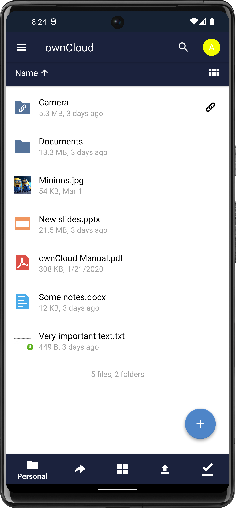
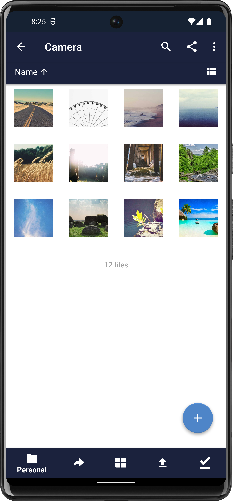
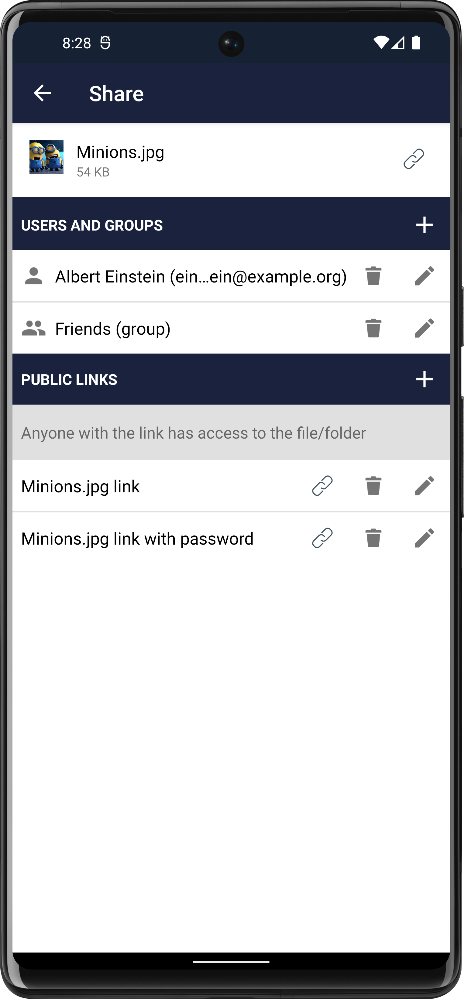
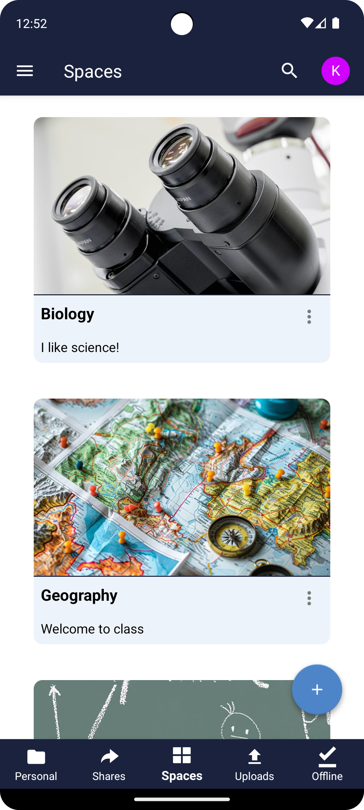

# ownCloud Android App

<!-- OSPO-managed README | Generated: 2026-04-16 | v2 -->

[](LICENSE.txt) [](https://kiteworks.com/opensource)

[](https://github.com/owncloud/android/actions/workflows/android-unit-tests.yml) [](https://github.com/owncloud/android/actions/workflows/android-instrumented-data-tests.yml) [](https://github.com/owncloud/android/actions/workflows/detekt.yml) [](https://github.com/owncloud/android/actions/workflows/conventional-commits.yml)

The ownCloud Android app enables users to access, sync, and share files stored on their ownCloud server directly from Android devices. Built with Kotlin, it supports ownCloud Infinite Scale (oCIS) and ownCloud Classic servers, featuring file browsing, photo galleries, Spaces, sharing, passcode lock, and biometric authentication. The app is available on:

<a href="https://play.google.com/store/apps/details?id=com.owncloud.android"></a><a href="https://f-droid.org/packages/com.owncloud.android/"></a>

|  |  |  |  |
| ---------------------------------------------- | -------------------------------------------- | ------------------------------------------- | ------------------------------------------- |

## Part of Mobile (Android)

This is the official [ownCloud Android app](https://github.com/owncloud/android), the primary mobile client for Android users. It connects to both [ownCloud Infinite Scale (oCIS)](https://github.com/owncloud/ocis) and [ownCloud Classic](https://github.com/owncloud/core).

## Getting Started

1. Read [SETUP.md](https://github.com/owncloud/android/blob/master/SETUP.md) for development environment setup
2. Fork the repository and clone it locally
3. Open the project in Android Studio
4. Build and run using `./gradlew assembleDebug`

### Beta Testing

- **Play Store:** Download the app from Play Store, scroll down to the beta section, and tap "I'm in"
- **F-Droid:** Open the ownCloud tab in F-Droid and download the latest beta version

## Documentation

- [SETUP.md](https://github.com/owncloud/android/blob/master/SETUP.md) - Development setup guide
- [CONTRIBUTING.md](CONTRIBUTING.md) - Contribution guidelines
- [CHANGELOG.md](https://github.com/owncloud/android/blob/master/CHANGELOG.md) - Release history
- [ownCloud documentation](https://doc.owncloud.com)

## Community & Support

**[Star](https://github.com/owncloud/android)** this repo and **Watch** for release notifications!

- [ownCloud Website](https://owncloud.com)
- [Community Discussions](https://github.com/orgs/owncloud/discussions)
- [Matrix Chat](https://app.element.io/#/room/#owncloud:matrix.org)
- [Documentation](https://doc.owncloud.com)
- [Enterprise Support](https://owncloud.com/contact-us/)
- [OSPO Home](https://kiteworks.com/opensource)

## Contributing

We welcome contributions! Please read the [Contributing Guidelines](CONTRIBUTING.md)
and our [Code of Conduct](CODE_OF_CONDUCT.md) before getting started.

### Workflow

- **Rebase Early, Rebase Often!** We use a rebase workflow. Always rebase on the target branch before submitting a PR.
- **Dependabot**: Automated dependency updates are managed via Dependabot. Review and merge dependency PRs promptly.
- **Signed Commits**: All commits **must** be PGP/GPG signed. See [GitHub's signing guide](https://docs.github.com/en/authentication/managing-commit-signature-verification).
- **DCO Sign-off**: Every commit must carry a `Signed-off-by` line:
  ```
  git commit -s -S -m "your commit message"
  ```
- **GitHub Actions Policy**: Workflows may only use actions that are (a) owned by `owncloud`, (b) created by GitHub (`actions/*`), or (c) verified in the GitHub Marketplace.

## Translations

Help translate this project on Transifex:
**<https://explore.transifex.com/owncloud-org/owncloud-android/>**

Please submit translations via Transifex -- do not open pull requests for translation changes.

## Security

**Do not open a public GitHub issue for security vulnerabilities.**

Report vulnerabilities at **<https://security.owncloud.com>** -- see [SECURITY.md](SECURITY.md).

Bug bounty: [YesWeHack ownCloud Program](https://yeswehack.com/programs/owncloud-bug-bounty-program)

## License

This project is licensed under the [GPL-2.0](LICENSE.txt).

## About the ownCloud OSPO

The [Kiteworks Open Source Program Office](https://kiteworks.com/opensource), operating under
the [ownCloud](https://owncloud.com) brand, launched on May 5, 2026, to steward the open source
ecosystem around ownCloud's products. The OSPO ensures transparent governance, license compliance,
community health, and sustainable collaboration between the open source community and
[Kiteworks](https://www.kiteworks.com), which acquired ownCloud in 2023.

- **OSPO Home**: <https://kiteworks.com/opensource>
- **GitHub**: <https://github.com/owncloud>
- **ownCloud**: <https://owncloud.com>

For questions about the OSPO or licensing, contact ospo@kiteworks.com.

### License Migration to Apache 2.0

The OSPO is driving a strategic relicensing of ownCloud repositories toward the
[Apache License 2.0](https://www.apache.org/licenses/LICENSE-2.0), following
the [Apache Software Foundation's third-party license policy](https://www.apache.org/legal/resolved.html).

Individual repositories will migrate as their audit is completed. The LICENSE file
in each repo reflects its **current** license status (not the target).

**Current license: GPL-2.0** (Category X per Apache policy -- cannot be included in Apache-2.0 works).

Migration prerequisites for this repository:

- **CLA/DCO coverage**: All past contributors must have signed agreements permitting relicensing
- **Copyleft dependency audit**: All GPL dependencies must be replaced or isolated
- **KDE heritage review**: Any code with KDE-era copyrights requires legal analysis
- **Complete relicensing**: GPL-2.0 is a strong copyleft license; migration requires full relicensing of all files
