=============
Functionality
=============

New Features Wizard
-------------------

.. versionadded:: 2.7.0

The first time that you use the Android app, you will see the New Features Wizard.
The wizard, similar to wizards in other applications and operating systems, gives you a quick overview of the new features in the Android App, so that you’re familiar with them as quickly as possible.

The new features covered in the wizard are:

- :ref:`Pattern Lock <pattern_and_fingerprint_lock_label>`
- :ref:`Fingerprint Lock <pattern_and_fingerprint_lock_label>`
- :ref:`GIF Support <gif_support_label>`
- :ref:`Upload picture from camera <upload_pictures_directly_from_the_camera_label>`

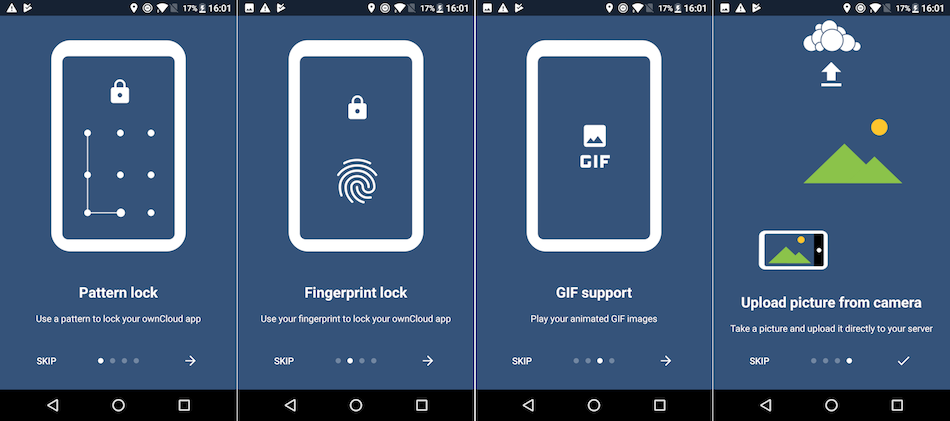

   The New Features Wizard in the ownCloud Android app.

Connecting to Your ownCloud Server
----------------------------------

The first time you run your ownCloud Android app, it opens to a configuration screen.
Enter your server URL, login name, password, and click the Connect button.
Click the eyeball to the right of your password to expose your password.

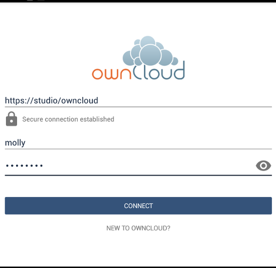

For best security, your ownCloud server should be `SSL-enabled`_ so that you can connect via HTTPS.
The ownCloud app will test your connection as soon as you provide it and tell you if you entered it correctly.
If your server has `a self-signed SSL certificate`_, you'll get a warning that it is not to be trusted.
If this happens, click the "YES" button to accept the certificate and complete your account setup.

.. figure:: images/android-3.png
   :alt: SSL certificate warning.

With that completed, you're now ready to use the Android application.
At this point, you'll be on the *"All Files"* screen, which you see below.

.. figure:: images/android-all-files-overview.png
   :alt: All files screen.

By clicking the main menu at the top left, you will be able to manage the core functionality of the app. The options are:

- `Manage Users Accounts`_
- `Current Uploads`_
- `All Files`_
- `Application Settings`_

Manage Users Accounts
---------------------

Initially the path to this section isn't visible.
To get to it, first click the down arrow, in the user details section, which will replace the ""All Files"" and *"Uploads"* buttons with *"Add account"* and *"Manage accounts"*.

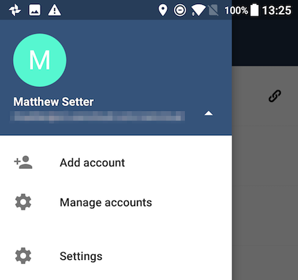

Then, click *"Manage accounts"*.
From there, you can see all of the currently active user accounts, along with a button to add a new account.

Viewing Accounts
~~~~~~~~~~~~~~~~

After clicking *"Manage accounts"*, you will see a list of the currently active accounts in the application, as in the screenshot below.
Each entry in the list has shortcuts to:

- View the user's files
- Change the user's password
- Remove the account

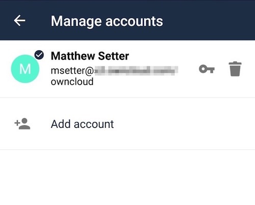

Adding Accounts
~~~~~~~~~~~~~~~

To add a new account is identical to creating the first account.
Click *"Add account"*, and then follow the instructions in `Connecting to Your ownCloud Server`_.

Removing Accounts & Logging Out
~~~~~~~~~~~~~~~~~~~~~~~~~~~~~~~

To remove an account, click the rubbish bin icon, next to the key icon.
This will display a confirmation dialog, asking if you want to remove the account.
If you click *"Yes"*, the account will be removed.

This action also logs you out of the server and deletes the database with the list of files.
However, any files downloaded onto the device prior to removal will still be there afterwards.
You can find them in the public partition.

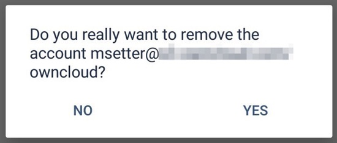

.. NOTE::
   There is no logout function that both logs out of your account **and** leaves
   all your files on your Android device.

Change User Passwords
~~~~~~~~~~~~~~~~~~~~~

To change a user's password, click the key icon, next to the user's details.
This will display the user details page, with the ownCloud server URI and user account, pre-filled.
Enter a new password, and click *"Connect"*, and the password will be updated.

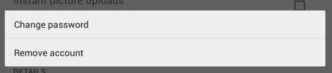

If you want extra security, please refer to the `Passcode Locks & Pins`_ section.

Manage Files
------------

View All Files
~~~~~~~~~~~~~~

When you are in the *"All Files"* view, all files that you have permission to access on your ownCloud server are displayed in your Android app.
However, they are not downloaded until you click on them.
Downloaded files are marked with a green tick, on the top-right of the file's icon.

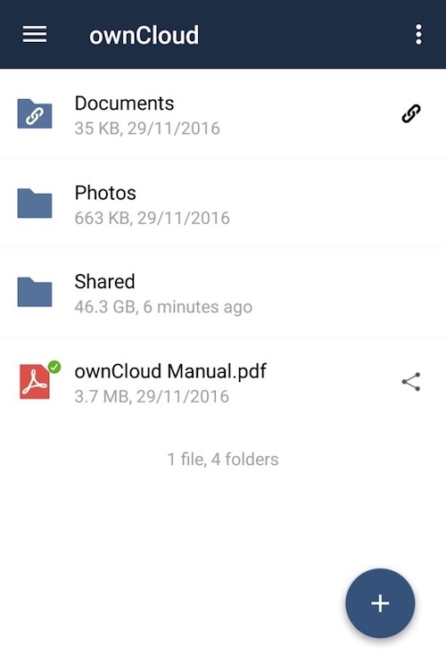

.. note::
   Videos don’t need to be downloaded before they can be viewed, as they can be streamed to the device from your ownCloud server.

Download and view a file with a short press on the file's name or icon.
Then, a short press on the overflow button opens a menu with options for managing your file.

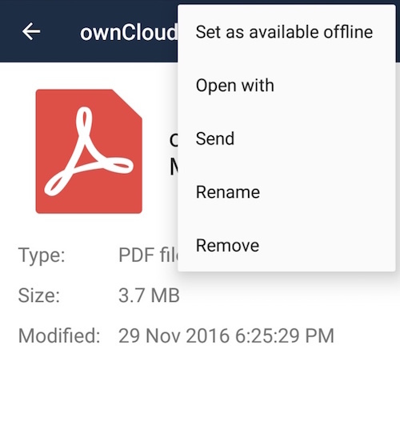

When you are on your main Files page and you long press on any file or folder a list of options appears, which you can see in the image below.
Some of them appear in the top bar.
The ones that don't fit in the top bar, appear in the list of options when pressing the overflow button.

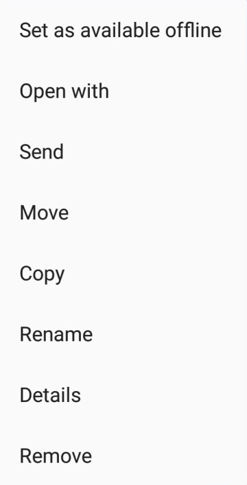

Sharing Files
~~~~~~~~~~~~~

You can share with other ownCloud users and groups, and create public or private share links.

.. note:: Multiple public links per/file is only available with ownCloud X.

To share a file, you first need to either:

1. Long-click its name, and click the share icon at the top of the screen
2. Click its name and then click the share icon at the top of the screen

The dialog which appears shows a list of users and groups with whom the file is already shared, as well as a list of one or more public links.

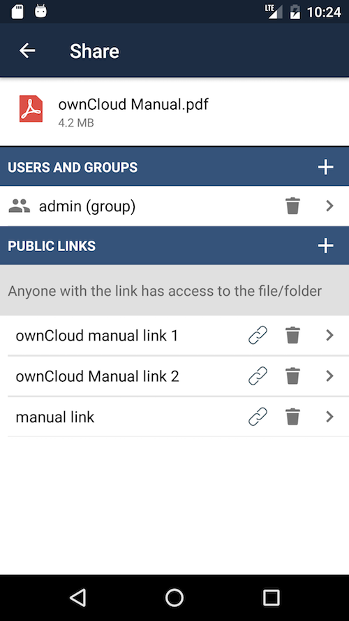

From here you can:
- Share one link to the file with users of the same ownCloud server
- Share the file with one or more users and groups
- Share one or more links to the file via a range of options
- Enable password protection
- Set a share expiration date

To create a private link, click the link icon on the right of the file name.

.. NOTE::
   Private link is available from ownCloud X.

To share the file with a new user or group, click the plus sign next to *"Users and Groups"*, where you will be able to find and add them to the share list.
After a user or group has been added, you can adjust the editing and on-sharing options available for them.

.. NOTE::
   If your ownCloud server administrator has enabled username auto-completion,
   when you start typing user or group names they will auto-complete.

You can create a Federated Share Link by entering the username and remote URL of the person you want to share with in this format: ``user@domain.com``.
You don't have to guess; the Personal page in the ownCloud Web GUI tells the exact Federated Cloud ID.
Just ask them to copy and paste and send it to you.

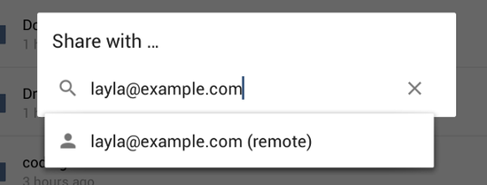

To create a public link, click the plus symbol next to *"Public Links"*.
This will display the options available for that link, including *"Allow editing"*, *"Password"*, and *"Expiration"*.
After the options have been suitably configured, click *"Save"* to create the link.
If you do not want to create the public link, click *"Cancel"*.

.. _gif_support_label:

GIF Support
~~~~~~~~~~~

.. versionadded:: 2.7.0

If you upload animated GIFs, when viewing them they will be animated and not render as a still image, as in the example GIF below.

.. figure:: images/gif-support-owncloud-android-app.png
   :alt: View animated GIFs in the ownCloud Android app.

   View animated GIFs in the ownCloud Android app.

Creating New Content
~~~~~~~~~~~~~~~~~~~~

To add new content, whether files, folders, or content from other apps, click the blue button at the bottom right to expose the *"Upload"*, *"Content from other apps"*, and *"New folder"* buttons.

Use the *"Upload"* button to add files to your ownCloud account from your Android filesystem.
Use **Content from other apps** to upload files from Android apps, such as the Gallery app.

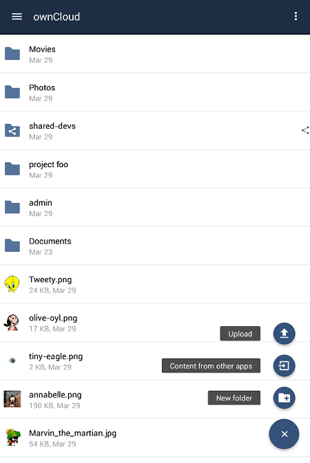

Click the overflow button at the top right (that's the one with three vertical dots) to open a user menu.
*"Grid view"* toggles between grid and list view. *"Refresh account"* syncs with the server, and *"Sort"* gives you the option to sort your files by date, or alphabetically.

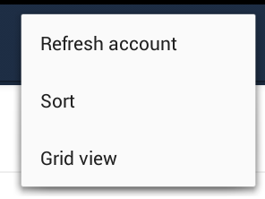

.. _upload_pictures_directly_from_the_camera_label:

Upload Pictures Directly From The Camera
^^^^^^^^^^^^^^^^^^^^^^^^^^^^^^^^^^^^^^^^

.. versionadded:: 2.7.0

.. figure:: images/camera/share-from-camera-owncloud-android-app.jpg
   :alt: Uploading pictures directly from the camera in the ownCloud Android app, steps 1 - 3.

   Uploading pictures directly from the camera in the ownCloud Android app, steps 1 - 3.

Images can be uploaded directly from the camera.
To do so, similar to uploading a file or creating a new folder, when viewing all files, click the *"Plus icon"*, then the *"Upload"* button in the popup list (which is the first icon).
From there, under *"Upload to ownCloud"*, click *"Picture from camera"*.
The camera app will then start, and the picture that you take can be directly uploaded to your ownCloud server.

Working With Multiple Files
~~~~~~~~~~~~~~~~~~~~~~~~~~~

The Android application can perform some operations on multiple files simultaneously, such as refreshing and deleting.
To select multiple files, long select the first file that you want to work with; you will see a checkbox appear on the far right-hand side.
After that, check the checkbox next to all the other files that you want to perform the same operation on, and then perform the operation.

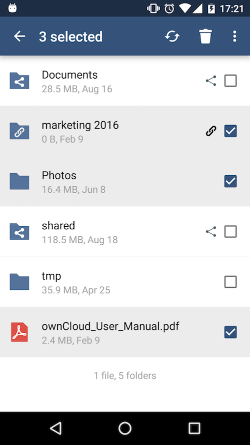

Uploading Files Taken From the Camera
~~~~~~~~~~~~~~~~~~~~~~~~~~~~~~~~~~~~~

Pictures and videos can be uploaded from your smartphone after choosing the folder where they are stored.
To specify where they are located, in the *"Settings"* options, under `Camera uploads`_, enable one of *"Picture uploads"* or *"Video uploads"*.
After that, a further option called *"Camera folder"* will become visible, as in the screenshot below.

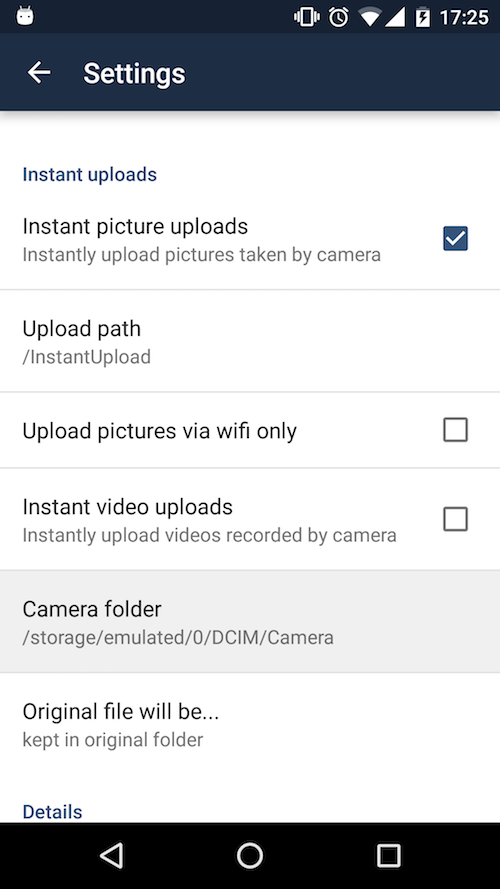

Current Uploads
~~~~~~~~~~~~~~~

The Uploads page displays the status of files currently uploading, a list of your recently uploaded files, and a Retry option for any failed uploads.
If credentials to access the file have changed, you'll see a credentials error.
Tap the file to retry, and you'll get a login screen to enter the new credentials.

If the upload fails because you're trying to upload to a folder that you do not have permission to access, you will see a *"Permissions error"*.
Change the permissions on the folder and retry the upload, or cancel and then upload the file to a different folder.

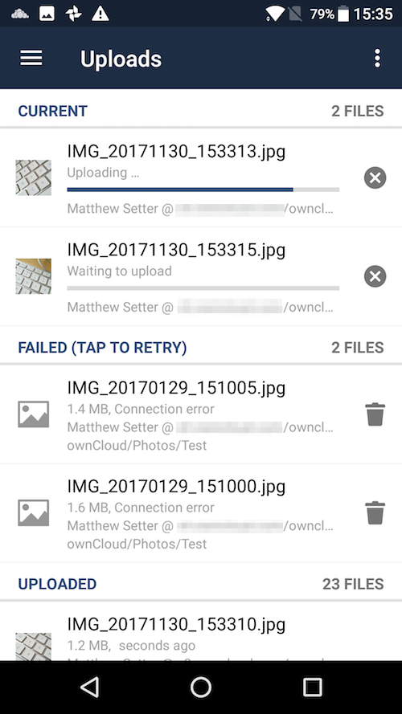

Make Folders Available Offline
~~~~~~~~~~~~~~~~~~~~~~~~~~~~~~

Folders can be made available for when no internet or mobile connectivity is available.
Doing so caches a copy of the folder and its contents locally to the device (assuming that sufficient disc space is available).
Depending on the number of folders selected for offline availability, how folders are made available offline works slightly differently.

- **A single folder:** When a single folder is selected, click the More options menu, which opens a popup menu, and then select the first option, labeled: *"Set as available offline"*.
- **Multiple folders:** When multiple folders are selected, click the down arrow icon near the top of the screen.

When the folders have been locally cached, the icon will change to have a yellow, down-arrow icon in the bottom right-hand corner, as in the screenshot below.

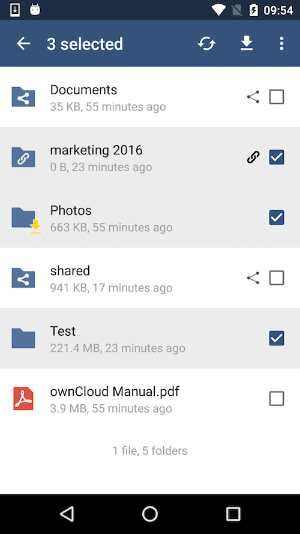

Application Settings
--------------------

Use the *"Settings"* screen to control your ownCloud applications settings and functionality.

.. figure:: images/android-settings-page.png
   :alt: The Settings Screen in the ownCloud Android App.

   The Settings Screen in the ownCloud Android App.

Camera Uploads
~~~~~~~~~~~~~~

If you take photos or create videos with your Android device, they can be automatically uploaded to your ownCloud server.
To enable this, under *"Camera uploads"* tap one or both of *Picture uploads* or *Video uploads*.

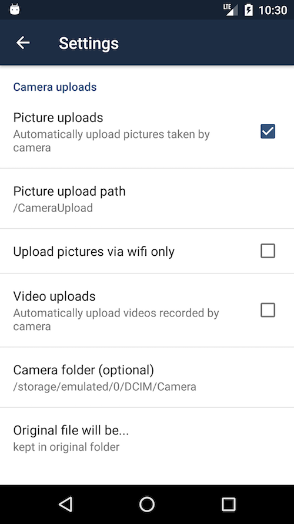

By enabling these features any new photos or videos which you create will be automatically uploaded every 15 minutes.
Photos and videos are not uploaded when they’re created, to focus on reliability, instead of immediacy, and to avoid battery draining caused by excessive checking of the camera folder.

.. note::
   Please be aware that if you used the earlier *Instant Uploads* feature, you will lose the configuration and have to enable the "Camera uploads" feature if you want to use it, since it needs to be initialized and configured properly.

If you’re concerned about mobile data usage, or have an account with limited data available, you can limit uploading to only when a WiFi is in use.
This option is visible once you've enabled the respective option.
For photos tap **"Upload pictures via wifi only"**.
For videos tap **"Upload videos via wifi only"**.

By default, photos and videos are uploaded to a directory called ``/CameraUpload``.
However, you also have the option to use an existing directory, or to create a new one.
To change the upload location, tap on *Picture upload path* under photos or *Video upload* path under videos, and choose one of the folders displayed.

To create a new folder, click the *More options* menu, in the top right-hand corner.
This will display the menu option: *New folder*.
Tap it and enter the name of the new folder in the *Folder name* dialog.
Then, tap the newly created folder and tap *Choose* in the bottom right-hand corner.
You'll see that the path has been updated.

Security
--------

Passcode Locks & Pins
~~~~~~~~~~~~~~~~~~~~~

You can also set a passcode lock to further protect your files and folders.
And, if you want extra security, you can set a login PIN on your Android device, and also on your ownCloud account. 
If you are using a shared Android device, other users can access your files in the file manager if you are sharing a single user account. 
To avoid this, you could set up multiple user accounts to protect your files.

The bottom section of the *"Settings"* screen has links to:

- Help
- Recommend to a friend
- Feedback 
- The version number

.. _pattern_and_fingerprint_lock_label:

Pattern Lock and Fingerprint Lock
~~~~~~~~~~~~~~~~~~~~~~~~~~~~~~~~~

.. versionadded:: 2.7.0

In addition to the Passcode Lock and Pins, you also have the ability to use both a pattern and a fingerprint lock to protect access to your ownCloud app and its data.
To enable one or both, under *"Settings"* -> *"Security"*, choose which one(s) you want to enable.

.. note:: To use the Fingerprint Lock, the Pattern Lock has to be enabled.

.. figure:: images/security/fingerprint-and-pattern-lock-enabled-disabled-owncloud-android-app.png
   :alt: Enable or disable the Fingerprint and Pattern Lock in the ownCloud Android app.

   Enable or disable the Fingerprint and Pattern Lock in the ownCloud Android app.

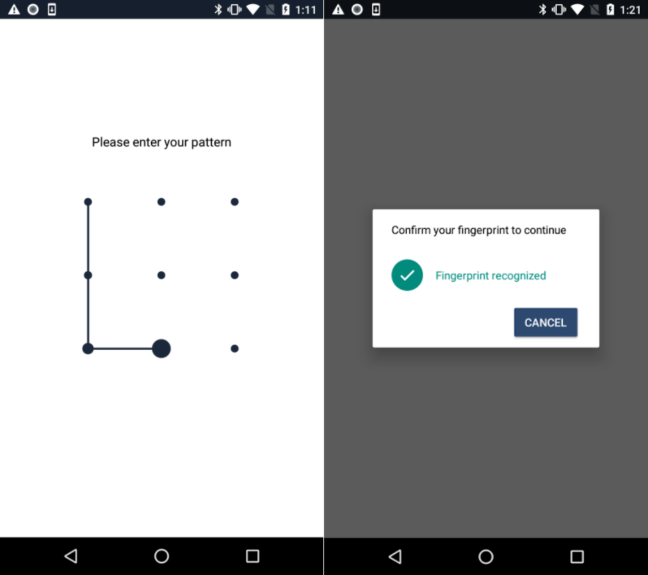

   The Pattern Lock and Fingerprint Lock in the ownCloud Android app.

After you enable the pattern lock, you will need to create a pattern and then confirm it to access the ownCloud app, just as you would if you've enabled that for access to the phone itself.
If you later disable pattern lock, you will need to enter your pattern again.

If you enable the fingerprint lock, you will need to provide one of your already stored fingerprint patterns to access the ownCloud app.

.. note::
   If fingerprint lock is enabled, but you don’t want to use it, you can cancel
   the fingerprint lock prompt and fallback to using the pattern lock instead.

.. Links

.. _a self-signed SSL certificate: https://www.digitalocean.com/community/tutorials/how-to-create-a-self-signed-ssl-certificate-for-apache-in-ubuntu-16-04
.. _SSL-enabled: http://info.ssl.com/article.aspx?id=10241
