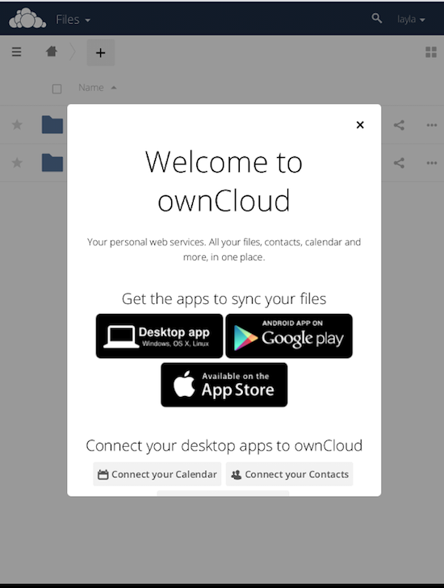

=======
Install
=======

One way to get your ownCloud Android app is to log into your ownCloud server from your Android device using a Web browser such as Chrome, Firefox, or Dolphin.

The first time you log into a new ownCloud account, you'll see a screen with a download link to the ownCloud app in the `Google Play Store <https://play.google.com/store/apps/details?id=com.owncloud.android>`_.

You will also find these links on your Personal page in the ownCloud Web interface.
Find source code and more information from the `ownCloud download page <http://owncloud.org/install/#mobile>`_.
Users of customized ownCloud Android apps, for example from their employer, should follow their employer's instructions.

